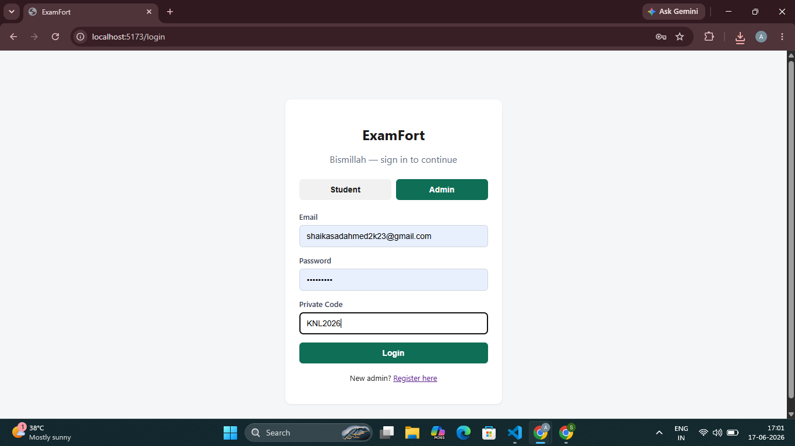
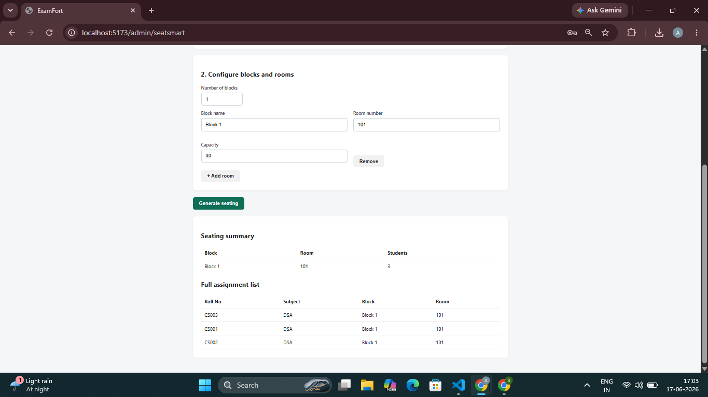
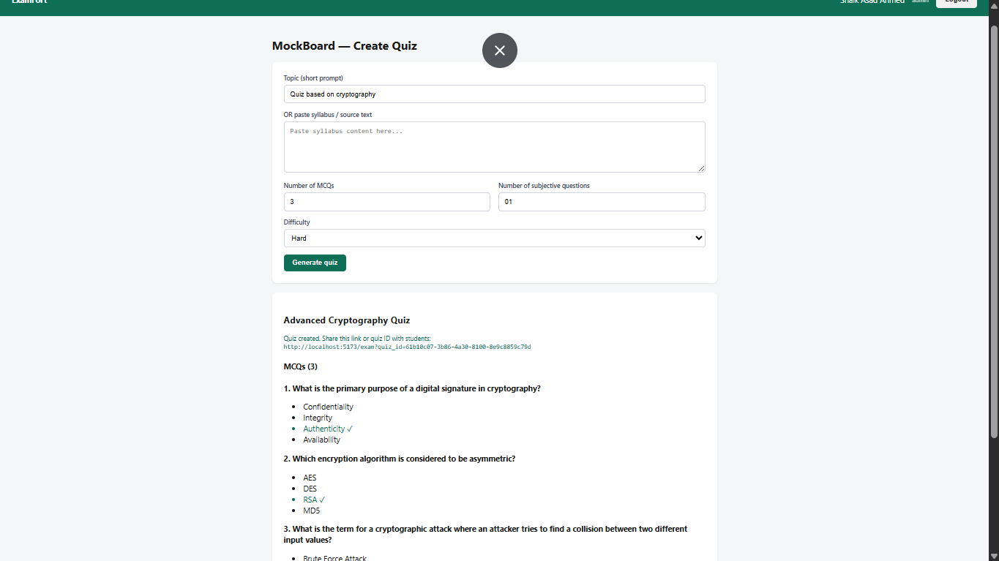
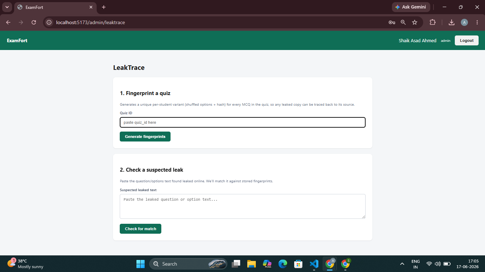
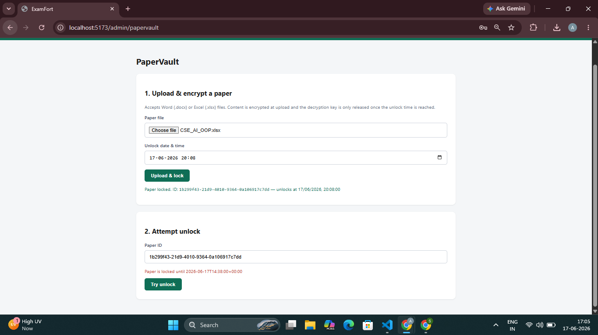
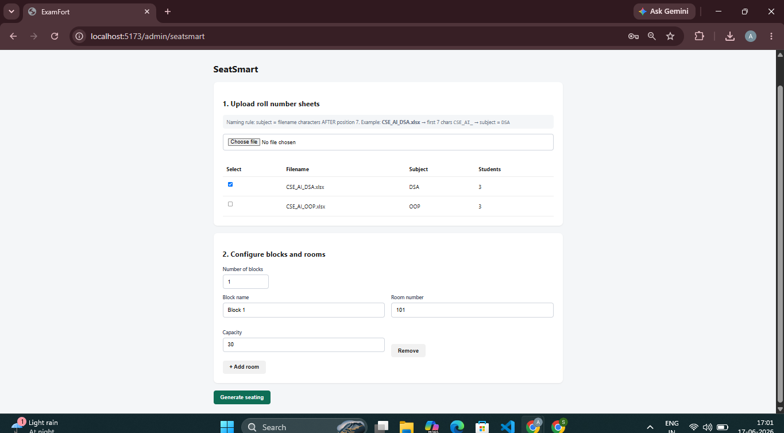
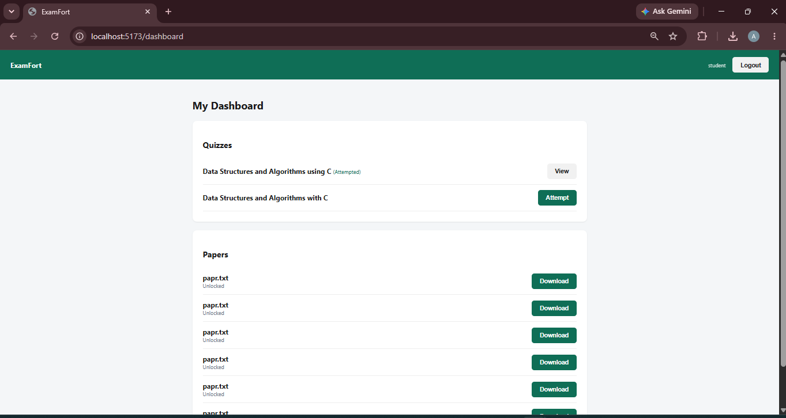
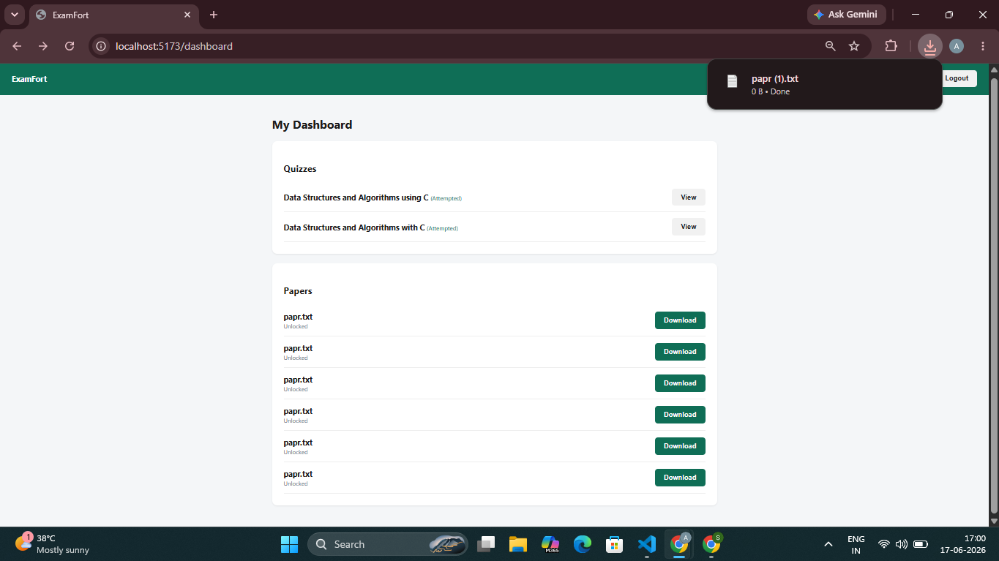
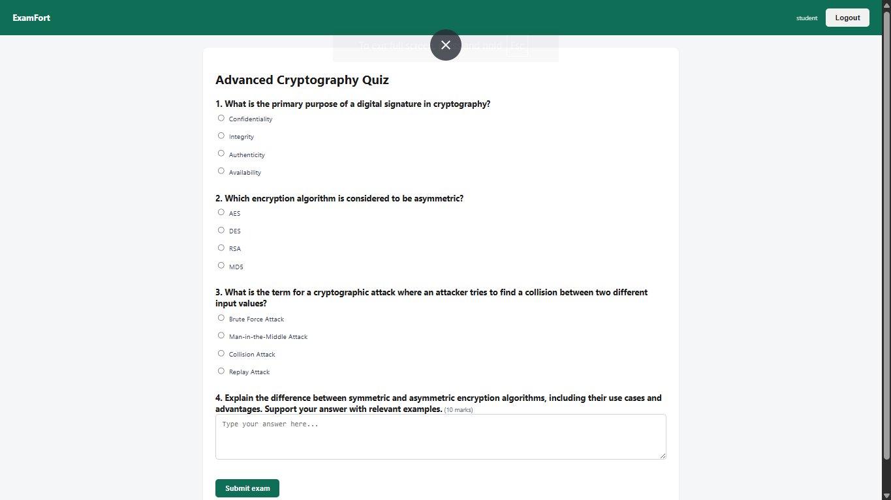
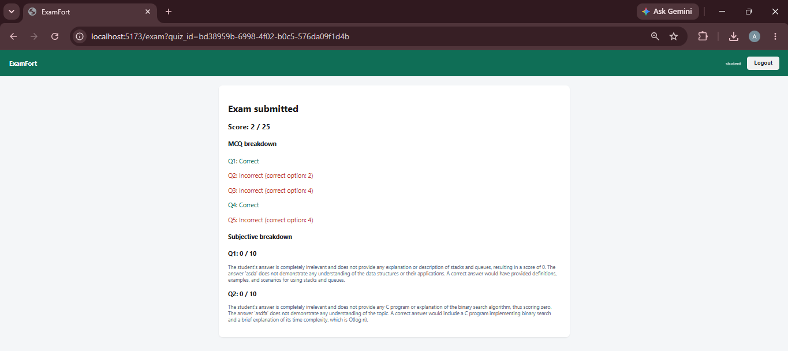

# ExamFort

ExamFort is a comprehensive exam management platform designed for schools and institutions to run mock exams, assign seats, manage paper vault security, and monitor student performance in real time. The application combines a Python/FastAPI backend with a React/Vite frontend to provide a smooth admin and student experience.

## Overview

This project delivers a full-stack solution for exam operations with separate interfaces for administrators and students:

- Admins can create mock exams, view leaderboards, monitor paper leaks, generate seating plans, and secure exam content.
- Students can log in, view their dashboard, attempt exams, and review results.

The system integrates authentication, real-time leaderboard reporting, secure paper handling, and intelligent seating assignments to streamline exam administration.

## Why ExamFort?

ExamFort is built to solve common challenges in mock exam delivery and classroom evaluations:

- Centralized exam management across admin and student workflows
- Secure content distribution with paper vault controls
- Visibility into student performance through leaderboards
- Automated seating generation to reduce cheating risk
- Support for both academic and training exam formats

## Core Features

- ✅ Admin authentication and protected admin dashboard
- ✅ Mock exam creation and leaderboard tracking
- ✅ Student login and exam access portal
- ✅ Paper vault tracking and leak monitoring
- ✅ Smart seating assignment and seating export
- ✅ Real-time score display and detailed student reports
- ✅ REST API backend with frontend integration

## Project Structure

```
examfort/
├── backend/
│   ├── requirements.txt
│   ├── app/
│   │   ├── core/
│   │   │   ├── config.py
│   │   │   ├── security.py
│   │   │   └── supabase_client.py
│   │   ├── models/
│   │   │   └── schemas.py
│   │   ├── routers/
│   │   │   ├── auth.py
│   │   │   ├── leaktrace.py
│   │   │   ├── mockboard.py
│   │   │   ├── papervault.py
│   │   │   ├── seatsmart.py
│   │   │   └── student.py
│   │   └── services/
│   │       ├── crypto_service.py
│   │       ├── fingerprint_service.py
│   │       ├── groq_service.py
│   │       └── seating_service.py
│   └── main.py
├── frontend/
│   ├── package.json
│   ├── vite.config.js
│   ├── src/
│   │   ├── api/
│   │   │   └── client.js
│   │   ├── components/
│   │   │   ├── Navbar.jsx
│   │   │   └── ProtectedRoute.jsx
│   │   ├── context/
│   │   │   └── AuthContext.jsx
│   │   ├── pages/
│   │   │   ├── AdminHome.jsx
│   │   │   ├── LeakTrace.jsx
│   │   │   ├── Login.jsx
│   │   │   ├── MockBoardCreate.jsx
n│   │   │   ├── MockBoardLeaderboard.jsx
│   │   │   ├── PaperVault.jsx
│   │   │   ├── RegisterAdmin.jsx
│   │   │   ├── SeatSmart.jsx
│   │   │   ├── StudentDashboard.jsx
│   │   │   └── StudentExam.jsx
│   │   ├── App.jsx
│   │   ├── index.css
│   │   └── main.jsx
├── Screenshots/
│   ├── AdminGeneratedSeating.png
│   ├── AdminLogin.png
│   ├── AdminMockBoard.png
│   ├── AdminPaperLeak.png
│   ├── AdminPaperVault.png
│   ├── AdminSmartSeat.png
│   ├── StudentDashboard.png
│   ├── StudentPageDowlnload.png
│   ├── StudentQuiz.png
│   └── StudentResults.png
```

## Tech Stack

- **Backend:** Python, FastAPI, Uvicorn, Supabase
- **Frontend:** React, Vite, JavaScript
- **Database:** Supabase/PostgreSQL (via Supabase client)
- **Auth:** JWT-based token authentication and protected routes

## Detailed Functionality

### Backend

- `app/core/config.py` holds environment and app configuration settings.
- `app/core/security.py` handles password hashing, token generation, and authentication checks.
- `app/core/supabase_client.py` connects to Supabase services used for persistence.
- `app/models/schemas.py` defines request and response models for validation.
- `app/routers/` exposes REST endpoints for all application workflows.
- `app/services/` implements data transformation, fingerprint logic, seating generation, and secure operations.

### Frontend

- `src/api/client.js` defines the API client used by the React app.
- `src/context/AuthContext.jsx` manages current user authentication state and token persistence.
- `src/components/Navbar.jsx` and `ProtectedRoute.jsx` provide navigation and route protection.
- `src/pages/` contains the major admin and student views used across the app.

## User Journeys

### Admin

1. Login with secure admin credentials
2. Create a new mock board or seat assignment
3. View leaderboard and exam scores
4. Monitor paper leaks and paper vault entries
5. Generate smart seating to minimize malpractice

### Student

1. Login with student credentials
2. Access the dashboard and view available exams
3. Take exams and submit answers securely
4. Review scores and leaderboard placement
5. Download exam materials or view results when available

## Setup Instructions

### Backend Setup

```bash
cd backend
python -m venv venv
venv\Scripts\activate
pip install -r requirements.txt
uvicorn app.main:app --reload
```

### Frontend Setup

```bash
cd frontend
npm install
npm run dev
```

Then open the local Vite URL shown in the terminal.

## Screenshots

<table>
  <tr>
    <td align="center" width="20%"><br/><b>Admin Login</b><br/><sub>Secure admin authentication landing page</sub></td>
    <td align="center" width="20%"><br/><b>Generated Seating</b><br/><sub>Automated smart seating assignment</sub></td>
    <td align="center" width="20%"><br/><b>Mock Board</b><br/><sub>Create and manage mock exams</sub></td>
    <td align="center" width="20%"><br/><b>Paper Leak Tracker</b><br/><sub>Monitor suspicious paper leak events</sub></td>
    <td align="center" width="20%"><br/><b>Paper Vault</b><br/><sub>Secure exam content storage</sub></td>
  </tr>
  <tr>
    <td align="center" width="20%"><br/><b>Seat Smart</b><br/><sub>Seat allocation and student placement</sub></td>
    <td align="center" width="20%"><br/><b>Student Dashboard</b><br/><sub>Student home with exam status and results</sub></td>
    <td align="center" width="20%"><br/><b>Download Page</b><br/><sub>Student access to download exam materials</sub></td>
    <td align="center" width="20%"><br/><b>Student Quiz</b><br/><sub>Exam interface for taking tests</sub></td>
    <td align="center" width="20%"><br/><b>Results View</b><br/><sub>Score overview and leaderboard placement</sub></td>
  </tr>
</table>

## Deployment

- Use Vercel or Netlify for the frontend
- Deploy the backend on a cloud server or serverless platform
- Update the API base URL in `frontend/src/api/client.js` for production

## Notes

- Keep the `Screenshots/` folder at the repository root for Markdown image rendering.
- If using Supabase, confirm credentials in backend environment variables before running.
- This repo targets educational exam management rather than a production-grade secure exam system.
